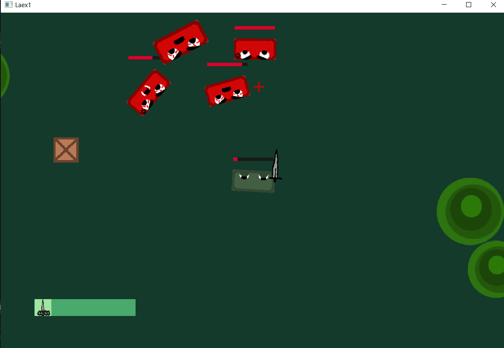

# Laex1
### 2D game made in C++/SFML

## Installing
- download the code and build it (you need to have sfml added to your project directory - [tutorial here](https://www.sfml-dev.org/tutorials/2.5/))
- add the "assets" folder to your .exe directory
- run the game

## Gameplay
[YouTube Gameplay](https://www.youtube.com/embed/gPPxdLDSbvs)

## Screenshots

# TODO
- [x] ~~add boss type enemies (basically the same as the others but stronger)~~ <- normal enemies can be stronger
- [x] ~~make sprites (textures for the game)~~ <- the ones that are already there look good (the look isn't the purpose of this project)
- [x] map generator
- [x] ~~add sounds~~ <- tried it, didn't like it
- [x] add screen states (different screens for starting, pausing and ending the game)
- [x] add different weapons (sword for sure, hand as default weapong for every entity)
- [x] add different terrain elements (box that can be moved around)
- [x] add different states to animation (so it's easy to control (now you have to give it a row index)
- [x] make enemies pick the best weapon they have in inventory 
- [x] add collisions to weapons (so they deal damage)
- [x] add sprite animations
- [x] remake hud
- [x] add enemies rotating to player when in range
- [x] add different types of enemies
- [x] implement HUD
- [x] make hud look good (add everthing)
- [x] Add inventory displaying
- [x] Add custom cursor (or hide it)
- [x] Add surroundings (terrain)
- [x] Add inventory
- [x] Add item for testing inventory
